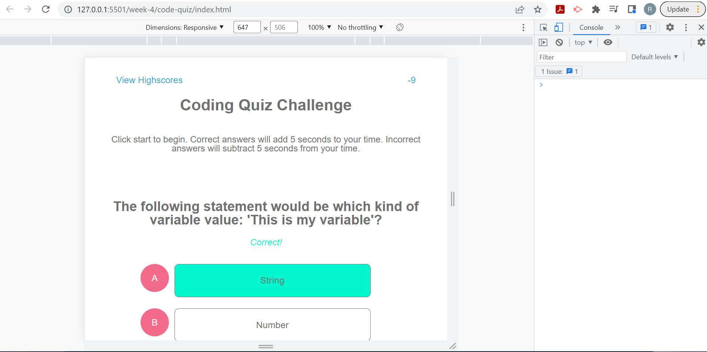

# Week Four Challenge: Code Quiz

## Description

This repository is where I build code to create a timed progressive quiz on javascript principles with a highscores leaderboard.

## Installation

N/A

## Usage

Click the 'Start' button to generate the first quiz question and then select an answer from the buttons provided. If the answer is correct, the button will turn green and 5 seconds will be added to the timer. If the answer is incorrect, the button will turn pink and 5 seconds will be removed from the timer. When all questions have been answered, or the timer reaches 0, the quiz will be finished. The time remaining will be entered as your score and you will have the option to enter your initials to save the score to local storage. Click 'View Highscores' to see a leaderboard of all saved times.

Website URL: (https://bechedley.github.io/code-quiz/)

    

## Credits

The following resources were referenced to ensure best practice and adherence to appropriate conventions:

Reference guidelines: A Guide to Flexbox by CSS Tricks (https://css-tricks.com/snippets/css/a-guide-to-flexbox/)

Online px to em font converter: CSS PX to EM Conversion by W3 Schools (https://www.w3schools.com/cssref/css_pxtoemconversion.asp)

Common js functions and parameters, for loops and arrays: JS CheatSheet by HTML CheatSheet (https://htmlcheatsheet.com/js/)

Information on pausing and stopping timers: Delay, Sleep, Pause, & Wait in JavaScript by sitepoint (https://www.sitepoint.com/delay-sleep-pause-wait/)

## License

Licensed under the standard MIT license. Please refer to the license in the repo for more information.